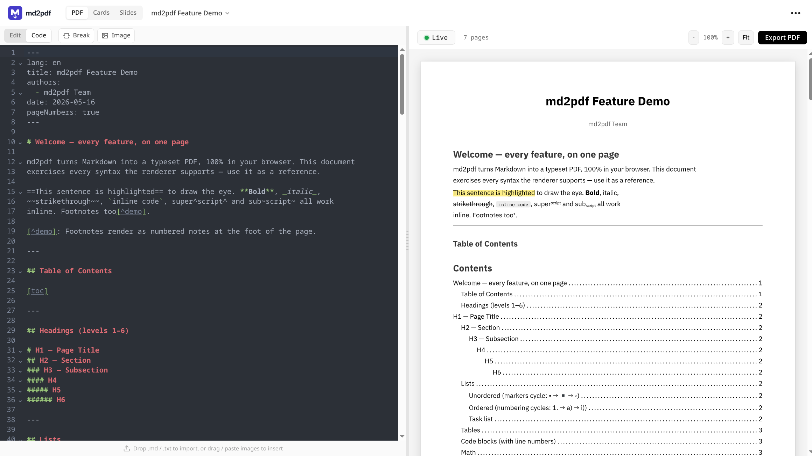
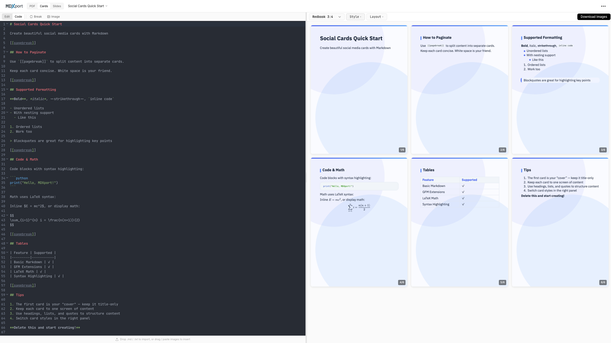
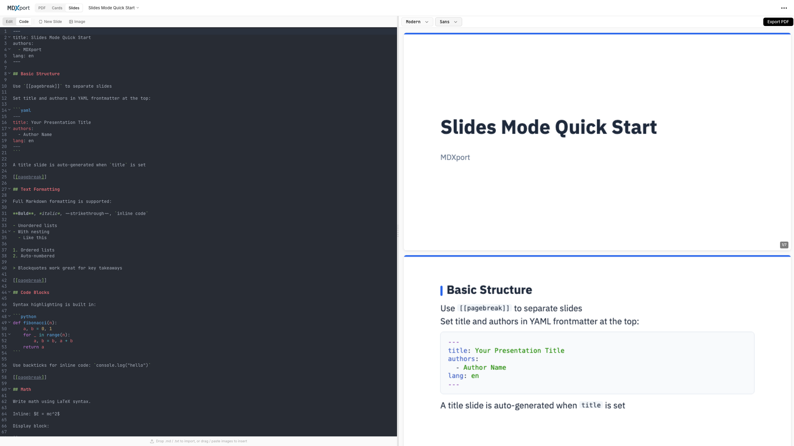
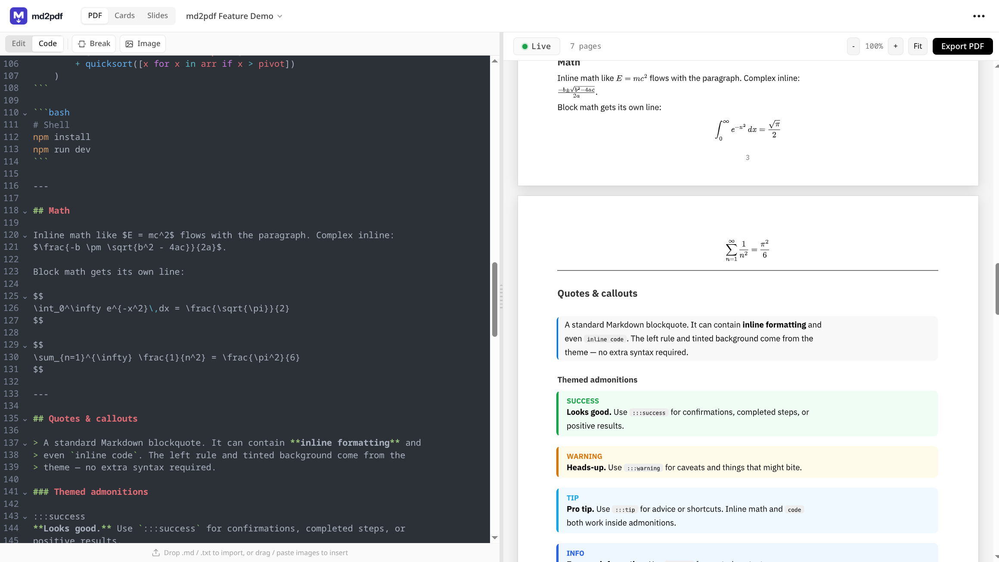

<p align="center">
  
</p>

# md2pdf

**Markdown to PDF, Cards & Slides — perfect typesetting, fully in the browser.**

md2pdf is a Markdown export tool built with [Svelte 5](https://svelte.dev/) and [Typst](https://typst.app/). Convert Markdown into professional PDFs, social media image cards, and presentation slides — all client-side, no setup, no server.

> Based on [cosformula/mdxport](https://github.com/cosformula/mdxport).

## ✨ Features

### Three export modes

- **PDF Documents** — Built-in templates for technical specs, weekly reports, resumes, AI chat notes, and Notion exports.
- **Image Cards** — Export beautiful social-card PNGs. 7 styles (clean, knowledge, dark, minimalist, modern, forest, blueprint) with customizable themes, sizes, and content density. Presets for Redbook, Instagram, X, and Story.
- **Presentation Slides** — Create slide decks from Markdown. 3 themes (modern, dark, minimal) with PDF export.

### Editing

- **Dual editor modes** — Switch between a code editor and a WYSIWYG editor (powered by [Milkdown](https://milkdown.dev/)).
- **Real-time preview** — Live SVG preview rendered directly from Typst.
- **Live update toggle** — Pause live preview and use `Ctrl/Cmd+Enter` (or the toolbar button) to compile on demand.
- **Page breaks** — Use `[[pagebreak]]` to control pagination across all modes.
- **Image upload** — Paste or drop images straight into the editor.

### Markdown coverage

- **GFM**: tables, task lists (rendered as real checkboxes), strikethrough.
- **`==highlight==`** — yellow highlight.
- **Admonitions** — `:::success`, `:::warning`, `:::tip`, `:::info`, `:::danger`.
- **Spoilers** — `+++++ … +++++`.
- **Math** (LaTeX, auto-converted to Typst), inline and block.
- **Mermaid** diagrams.
- **Twemoji** — both unicode emoji (😀) and shortcodes (`:innocent:`).
- **Footnotes**, super- and subscript.
- **Image sizing** — `` (HackMD style) and alt-text-as-caption.
- **Remote images** with an optional CORS-proxy fallback for blocked URLs.
- **`[toc]`** → Typst `#outline()`.

### Offline by default

All fonts (IBM Plex Sans, NewCMMath, DejaVu Sans Mono, Libertinus Serif, Noto Sans/Serif CJK, Noto Color Emoji) and all Twemoji SVGs are bundled into `static/` at build time. The only network call during a compile is user-supplied remote image URLs.

### More

- **Document management** — Auto-saves to IndexedDB; switch between recent documents.
- **Privacy-first** — Runs entirely client-side using WebAssembly. No analytics, no telemetry.
- **No setup** — No installation or account required.

## 📸 Screenshots

<p align="center">
  
  <br>
  <em>Split-screen editing with real-time PDF preview</em>
</p>

<p align="center">
  
  <br>
  <em>Export Markdown as beautiful social media cards</em>
</p>

<p align="center">
  
  <br>
  <em>Create presentation slides from Markdown</em>
</p>

<p align="center">
  
  <br>
  <em>Rich support for math, Mermaid diagrams, and charts</em>
</p>

## 🚀 Quick start

Visit [mdxport.com](https://mdxport.com) to start using it immediately.

### Local development

```bash
git clone https://github.com/libnewton/markdown2pdf.git
cd md2pdf
npm install
npm run dev
```

Production build (static site):

```bash
npm run build
```

## 🛠️ Tech stack

- **Framework**: [Svelte 5](https://svelte.dev/) + [SvelteKit](https://kit.svelte.dev) (`adapter-static`)
- **Typesetting**: [Typst](https://typst.app/) via WASM
- **WYSIWYG editor**: [Milkdown](https://milkdown.dev/) (Crepe)
- **Markdown parsing**: [unified](https://unifiedjs.com/) + remark
- **Preview rendering**: [typst.ts](https://github.com/Myriad-Dreamin/typst.ts) SVG renderer
- **Diagrams**: [Mermaid](https://mermaid.js.org/)

## 🔗 Related projects

- [mdxport-cli](https://github.com/cosformula/mdxport-cli) — single-binary CLI for Markdown to PDF (`npm install -g @mdxport/cli`).
- [markdown2typst](https://github.com/Mapaor/markdown2typst) — standalone npm package for Markdown to Typst by [@Mapaor](https://github.com/Mapaor).

## 📄 License

[MIT](LICENSE)
