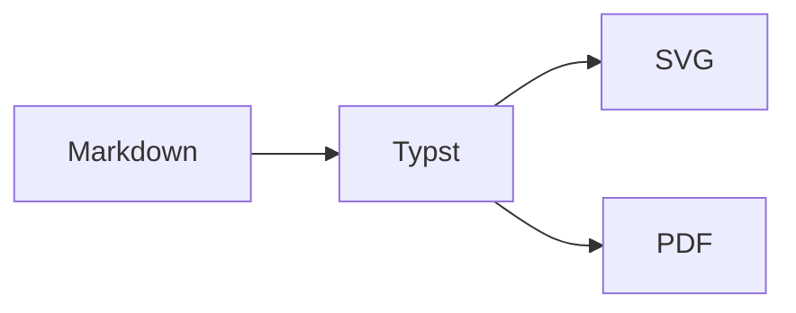

# Welcome — every feature, on one page

md2pdf turns Markdown into a typeset PDF, 100% in your browser. This document
exercises every syntax the renderer supports — use it as a reference.

==This sentence is highlighted== to draw the eye. **Bold**, _italic_,
~~strikethrough~~, `inlince code`, super^script^ and sub~script~ all work
inline. Footnotes too[^demo].

[^demo]: Footnotes render as numbered notes at the foot of the page.

---

## Table of Contents

[toc]

---

## Headings (levels 1–6)

# H1 — Page Title
## H2 — Section
### H3 — Subsection
#### H4
##### H5
###### H6

---

## Lists

### Unordered (markers cycle: • → ▪ → ◦)

- First level
- Another item
  - Second level (filled square)
  - And another
    - Third level (hollow circle)
    - More nesting
- Back to first

### Ordered (numbering cycles: 1. → a) → i))

1. First item
2. Second item
   1. Sub-item a
   2. Sub-item b
      1. Deep roman one
      2. Deep roman two
3. Third item

### Task list

- [x] Set up the project
- [x] Write the demo
- [ ] Ship to production
- [ ] Celebrate

---

## Tables

| Feature       | Supported | Notes                                  |
| ------------- | --------- | --------------------------------------++ |
| GFM tables    | yes       | left/right/center alignment            |
| Headers       | yes       | light grey background, rounded corners |
| Inline markup | yes       | **bold**, `code`, [links](#)           |

| Left   |  Center  |  Right |
| :----- | :------: | -----: |
| left   |  middle  |  right |
| col    |   col    |    col |

---

## Code blocks (with line numbers)

```typescript
// TypeScript — line numbers appear in the gutter
import { markdownToTypst } from '$lib/pipeline/markdownToTypst';

export function build(md: string) {
  return markdownToTypst(md, { style: 'modern-tech' });
}
```

```python
# Python
def quicksort(arr):
    if len(arr) <= 1:
        return arr
    pivot = arr[len(arr) // 2]
    return (
        quicksort([x for x in arr if x < pivot])
        + [x for x in arr if x == pivot]
        + quicksort([x for x in arr if x > pivot])
    )
```

```bash
# Shell
npm install
npm run dev
```

---

## Math

Inline math like $E = mc^2$ flows with the paragraph. Complex inline:
$\frac{-b \pm \sqrt{b^2 - 4ac}}{2a}$.

Block math gets its own line:

$$
\int_0^\infty e^{-x^2}\,dx = \frac{\sqrt{\pi}}{2}
$$

$$
\sum_{n=1}^{\infty} \frac{1}{n^2} = \frac{\pi^2}{6}
$$

---

## Quotes & callouts

> A standard Markdown blockquote. It can contain **inline formatting** and
> even `inline code`. The left rule and tinted background come from the
> theme — no extra syntax required.

### Themed admonitions

:::success
**Looks good.** Use `:::success` for confirmations, completed steps, or
positive results.
:::

:::warning
**Heads-up.** Use `:::warning` for caveats and things that might bite.
:::

:::tip
**Pro tip.** Use `:::tip` for advice or shortcuts. Inline math and `code`
both work inside admonitions.
:::

:::info
**For your information.** Use `:::info` for neutral context.
:::

:::danger
**Do not do this.** Use `:::danger` for destructive or dangerous actions.
:::

### Spoiler

+++++
Click to reveal

The body of a spoiler is indented under the summary line. You can write
**any markdown** inside, including `code` and lists:

- one
- two
- three
+++++

---

## Images

Local images, remote images, captions, and explicit dimensions are all
supported. Images are centered automatically; if you supply alt text, it
becomes a small caption beneath the image.


You can also size without a caption, or include a remote image at its
natural width.

---

## Emojis

Unicode emoji are rendered as Twemoji SVGs (offline, bundled): 😀 🚀 🔥 ✨ 🎉 📄 🛡️.

Shortcodes work too: :smile: :heart: :rocket: :tada: :sparkles: :warning: :white_check_mark:.

---

## Links & references

Inline: [md2pdf README](https://github.com/libnewton/markdown2pdf).

Reference style: [SvelteKit][sk] and [Typst][typst] power the rendering.

[sk]: https://kit.svelte.dev
[typst]: https://typst.app

---

## Diagrams (Mermaid)



---

## Frontmatter & controls

Everything below is switched on in *this* document's own YAML block — scroll
back to page one, or to the top of any page, to see each one at work.

- `title:` — the document title; also the `{title}` placeholder
- `authors:` — one name or a list
- `date:` — feeds the cover page and the `{date}` placeholder
- `lang:` — `en`, `de`, `de-AT`, … drives hyphenation, smart quotes and
  Typst's built-in titles: under `lang: de` a `[toc]` is headed
  "Inhaltsverzeichnis" instead of "Contents"
- `pageNumbers:` — `true`, `false`, or a format: `"1"` for a bare number,
  `"1/1"` for `3 / 12` (what this document uses). The menu toggle is only a
  default — frontmatter wins.

---

## Running header & footer

Six optional slots — `header-left`, `header-center`, `header-right` and the
same three for `footer-`. They are small, grey, have no separating rule, and
start on the **second** page, so a cover or title page stays clean. This
document uses four of them:

```yaml
---
pageNumbers: "1/1"      # -> the "4 / 12" in the footer centre
header-left: "{title}"
header-right: "{date}"
footer-left: md2pdf
---
```

Placeholders: `{page}`, `{pages}`, `{title}`, `{subtitle}`, `{author}`,
`{authors}`, `{date}`. Anything unrecognised is left as written.

A slot can hold a graphic instead of text, using ordinary Markdown image
syntax. A remote `https://` URL works there too, and is fetched exactly like a
body image:

```yaml
header-right: ""   # =WxH in points, =x22 sets height only
```

`footer-center` defaults to the page number, so leaving every slot unset keeps
the familiar centered number and nothing else.

---

## Cover page

Page one of this document is a cover. Set `cover:` to one of `arcs`, `strata`,
`wedge` or `grid`. The cover counts as page one, so the first content page is
numbered 2 and the header and footer begin there. Title, subtitle, authors and
date all move onto it.

```yaml
---
title: md2pdf Feature Demo
authors: [md2pdf Team]
date: 2026-05-19
cover: arcs
cover-color: ocean                     # ocean | ink | ember | plum | any #hex
cover-subtitle: Every feature, one document
cover-logo: ""            # optional, placed top-right
---
```

The four geometries fill the bottom of the page: `arcs` (quarter-discs from
the bottom-left), `strata` (slanted bands), `wedge` (one diagonal), `grid` (a
fading dot lattice over solid bars). The palette tints the geometry and the
hairline under the title; cover text is always black. Cover mode and letter
mode are mutually exclusive — letter mode wins.

---

## Layout & alignment

Wrap any block in `:::left`, `:::center`, or `:::right` to align it. Wrap
multiple blocks (separated by blank lines) in `::::row` to lay them out
side by side as equal-width columns.

:::center
#### A centered subheading

This paragraph is centered too.
:::

::::row
First column — left-aligned paragraph.

Second column with **bold**.

Third column ends here.
::::

Use a deeper fence (4 colons) when nesting other directives — e.g. two
admonitions next to each other:

::::row
:::tip
Tip on the left.
:::

:::warning
Warning on the right.
:::
::::

---

## German letter mode (DIN 5008)

Add any of the `letter-*` fields to the frontmatter and the first page
switches to a DIN 5008 Form B layout: address window at 25 mm / 45 mm so it
lines up with a DIN long envelope, sender info on the right, subject + place
date on the same line, body content from 98.46 mm down. Page margins switch
to 20 mm on both sides. All fields are optional and independent.

```yaml
---
title: Mietvertrag-Kündigung
letter-return: Anna Beispiel, Lindenweg 7, 10115 Berlin
letter-to:
  - Hausverwaltung Müller GmbH
  - z. Hd. Frau Schmidt
  - Friedrichstraße 100
  - 10117 Berlin
letter-from:
  - Anna Beispiel
  - Lindenweg 7
  - 10115 Berlin
  - "Tel.: 030 1234567"
letter-subject: "Kündigung des Mietvertrags zum 31.08.2026"
letter-date: "Berlin, den 17.05.2026"
---
```

---

## Page breaks

Use `---` for a horizontal rule, or the explicit token `[[pagebreak]]` to
start a new page right here:

[[pagebreak]]

## You are now on a new page

Anything after the token continues on the next page. Combine with sections to
keep chapters cleanly separated.

> **One more tip**: Press <kbd>Ctrl</kbd>+<kbd>Enter</kbd> in the editor to
> trigger a compile immediately, even when live preview is paused.
