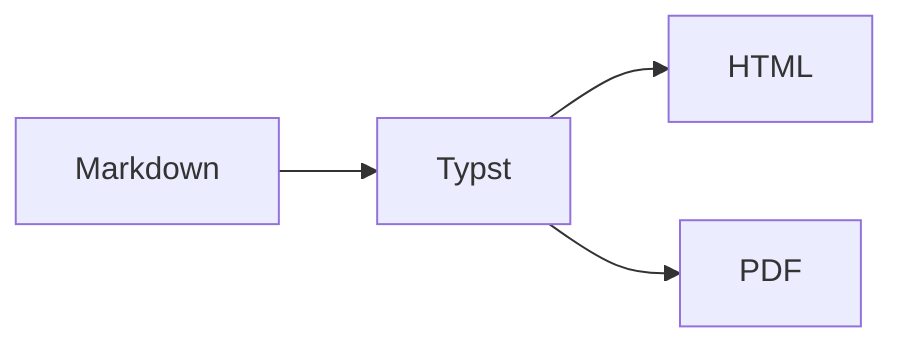

[toc]

## Semantics and Unicode

Paragraph retention marker: café, 日本語, العربية, 😀. A very long link remains usable: <https://example.com/a/very/long/path/that/must/wrap/without/overflowing/the/reading/column?alpha=one&beta=two>.

### Lists and tasks

- Outer item
  - Nested item with **strong text**
    1. Ordered depth
    2. Another item[^edge]
- [x] Complete state
- [ ] Incomplete state

[^edge]: Accessible footnote content retention marker.

#### Callouts inside a row

::::row
:::tip Nested tip
Tip content with `inline code`.
:::

:::danger
Danger content with a nested list:

- first
- second
:::
::::

##### Disclosure

+++++ Reveal the edge content
Keyboard-accessible spoiler content.

- hidden one
- hidden two
+++++

###### Deep heading

All six document heading levels remain semantic.

## Wide content

| Header A | Header B | Header C | Header D | Header E |
| :------- | :------: | -------: | -------- | --------++ |
| alpha | beta | gamma | delta | This deliberately long cell checks horizontal scrolling without clipping content. |

```typescript
const exceptionallyLongIdentifierThatMustScrollInsteadOfBreakingTheLayout = "abcdefghijklmnopqrstuvwxyz0123456789abcdefghijklmnopqrstuvwxyz0123456789";
```

Inline math $E = mc^2$ and display math:

$$
\int_0^1 x^2\,dx = \frac{1}{3}
$$



## Images and layout

:::center

:::

:::right

:::

::::row
First responsive column.

Second responsive column.

Third responsive column.
::::

[[pagebreak]]

## References

External links stay external, while the cited item [@typst] becomes an internal reference.

@misc{typst,
  author = {The Typst Project Developers},
  title = {Typst},
  year = {2026},
  url = {https://typst.app}
}
