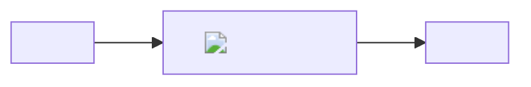
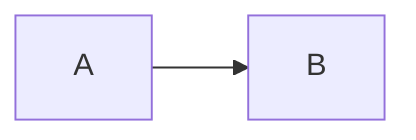

# This H1 loses to the frontmatter title

Adversarial input for the HTML renderer. Everything here must render without
panicking, and nothing here may become executable markup.

This fixture is for the HTML target only: it deliberately contains input the
PDF path rejects outright (broken LaTeX, unresolvable images), because the
point is that HTML degrades instead of failing. `extended.md` is the fixture
that has to build in both targets.

## Injection attempts

Inline: <script>alert(1)</script> and  and
<iframe src="https://example.com"></iframe> and <style>body{display:none}</style>.

A raw block:

<div onclick="alert(1)" style="position:fixed;inset:0">raw html block</div>

Link schemes: [javascript](javascript:alert(1)), [vbscript](vbscript:alert(1)),
[data](data:text/html,<script>alert(1)</script>), [file](file:///etc/passwd),
[mailto](mailto:a@example.com), [relative](./other.md), [anchor](#injection-attempts).

An image whose alt and title both try something. The URL is remote so the CLI
can run this file end to end — a *local* path that does not exist is a hard
error in both targets, the same as it already is for the PDF:


Attribute breakouts in a heading and a table:

### "><script>alert(1)</script>

| `<script>a</script>` | `" onmouseover="x` |
| -------------------- | ------------------ |
| <b onclick=x>        | &lt;already&gt;    |

Ampersands: a & b &amp; c &notareal; &#x41; &#65;

## Schemes that try to hide

The scheme check is an allowlist, so an encoded or padded `javascript:` has to
fail the same way a plain one does:

[entity](&#106;avascript:alert(1)), [hex entity](&#x6a;avascript:alert(1)),
[padded](&#0000106;avascript:alert(1)), [leading space]( javascript:alert(1)),
[tab inside](java&#9;script:alert(1)), [newline inside](java&#10;script:alert(1)),
[upper](JaVaScRiPt:alert(1)), [null](java&#0;script:alert(1)),
[protocol-relative](//example.invalid/x), [svg data](data:image/svg+xml,<svg onload="alert(1)"/>).

## Diagram from hostile source

The SVG a diagram renders to is never inlined, so nothing in here can become
markup even if the plugin passes a label straight through:



## Inline tag whitelist

Only `<br>` survives as markup; every other shape is text:
<u foo=bar>attrs</u>, < u>space</ u>, <u/>self-closed, <U>upper</U>,
<br>, <br/>, <br />, <bR>, <break>, <u<script>nested</u>.

## Math that tries to escape

Inline $\text{</span>}$ and
$\href{javascript:alert(1)}{click}$ and $a < b$ and $\text{"quoted"}$ and
a block:

$$\text{</math><script>alert(1)</script>}$$

## Sizes and widths that try to escape

</script>")
x100")

| a | b |
| --- | ---+++"onload="alert(1) |
| c | d |

## Id collisions

The drawer toggle and the footnote anchors have fixed ids, and a heading slug
must not be able to take one over.

### md2pdf-toc-state

### md2pdf-fn-1

### md2pdf-root

A footnote to collide with[^1].

[^1]: The real note.

## Duplicate headings

### Same heading

### Same heading

### Same heading

### ***

### 🎉

## Structure stress

Eight levels of nesting:

- 1
  - 2
    - 3
      - 4
        - 5
          - 6
            - 7
              - 8

A loose list with blocks inside:

1. First paragraph

   Second paragraph of the same item.

   ```js
   const inside = "a list";
   ```

   > and a quote

2. [ ] not a task list, because the list is ordered

Task list with nesting:

- [x] done
  - [ ] child still open
- [ ] open with `code` and **bold**

A row with six columns:

::::row
one

two

three

four

five

six
::::

Admonitions nested three deep:

:::::::info Outer
::::::warning Middle
:::::danger Inner
Deepest body with a [link](https://example.com) and $x^2$.
:::::
::::::
:::::::

A spoiler holding a table:

+++++ Reveal the table
| a | b |
| - | - |
| 1 | 2 |
+++++

## Fences

A fence with a language that does not exist:

```brainfuck
+++++[->+++++<]>
```

A fence containing fences:

`````md

`````

The same diagram twice — they must share one asset:


Highlighter stress — unterminated string, then live code:

```python
s = "never closed
def after(x): return x  # this must still be visible
```

```html
<a href="x" data-y='z'>text</a> a < b <!-- comment -->
```

```diff
@@ -1,2 +1,2 @@
-removed
+added
```

## Math

Inline $a < b$, $\alpha \& \beta$, and a broken one: $\frac{a$.

$$
\sum_{i=1}^{n} \frac{x_i}{\sqrt{1 - x_i^2}} = \int_0^1 f(t)\,dt
$$

Display math with an ampersand:

$$
\begin{aligned}
a &= b + c \\
d &= e - f
\end{aligned}
$$

## Footnotes

One reference[^dup], the same again[^dup], one that recurses[^loop], and one
that was never defined[^missing].

[^dup]: Referenced twice, numbered once.
[^loop]: This note refers to itself[^loop].

## Citations

See [@knuth] and [@lamport], then [@knuth] once more. A bare `[@notacite]`
inside code must stay literal.

## Wide table

| c1 | c2 | c3 | c4 | c5 | c6 | c7 | c8 | c9 | c10 | c11 | c12 |
| -- | -- | -- | -- | -- | -- | -- | -- | -- | --- | --- | --- |
| a very long unbreakable value aaaaaaaaaaaaaaaaaaaaaaaaaaaaaaaaaaa | b | c | d | e | f | g | h | i | j | k | l |

Weighted columns:

| narrow | wide      | widest      |
| ------ | --------- | ----------- |
| 1fr    | 2fr       | 3fr         |
| ---    | ---+      | ---++       |

Actual weight markers:

| narrow | wide | widest |
| --- | ---+ | ---++ |
| a | b | c |

## Long words and URLs

Supercalifragilisticexpialidociousantidisestablishmentarianismpneumonoultramicroscopicsilicovolcanoconiosis

https://example.com/a/very/long/path/that/keeps/going/and/going/and/going?with=query&and=more&params=here

## Emoji

Plain 😀, ZWJ family 👨‍👩‍👧, flag 🇦🇹, keycap digits 1 2 3, shortcode :rocket:,
and one wrapped in **bold 🎉 emphasis**.

## Blank line runs


Three blank lines above this paragraph.

[[pagebreak]]

After a page break.

[toc]

## The end

An entry opener inside a fence must not start the bibliography:

```bibtex
@article{not-a-real-entry, title = {Inside a fence}}
```

@article{knuth, author = {Donald E. Knuth}, title = {The Art of Computer Programming}, publisher = {Addison-Wesley}, year = {1968}}
@inproceedings{lamport, author = {Leslie Lamport}, title = {Time, Clocks, and the Ordering of Events}, booktitle = {CACM}, volume = {21}, number = {7}, pages = {558--565}, year = {1978}}
